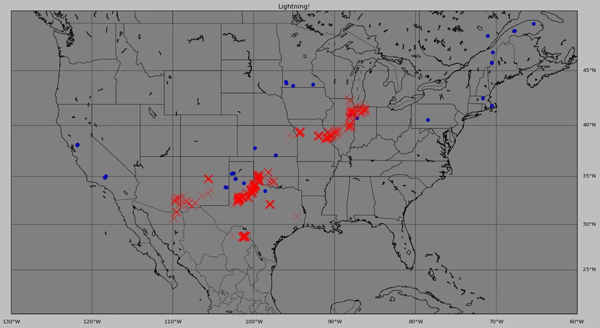

# python-lightning-earthnetworks

This script maps real-time lightning strike locations in the continental United States using a TCP socket datafeed of lightning data from Earth Networks. 

<h1>WHAT</h1>

Earth Networks is a provider of global weather data and operates the [Earth Networks Total Lightning Network (ENTLN)](https://www.earthnetworks.com/networks/lightning/ "EarthNetworks-Lightning"), one of three lightning networks in the United States that provides real-time information about lightning strikes.  

Earth Networks provides access to real-time lightning data from the ENTLN via a TCP socket connection, referred to as the [ENTLN Data Feed](http://www.bandgap.cs.rice.edu/classes/comp410/resources/SiteAssets/Using%20IoT/WeatherBug%20API%20info/ENTLN%20Lightning%20Data%20Feed%20v3%20ICD%20-%20UM67.pdf "EarthNetworks-LightningDataFeed"). Note that access to this datafeed is restricted to paying subscribers.

In this script, it is shown how to (i) connect to the ENTLN Data Feed using Python, (ii) parse out lightning data from the JSON payloads received from the TCP socket, and (iii) plot lightning strike locations on a map of the continental United States.

<h1>HOW</h1>

The Python <i>socket</i> library is used to establish a TCP socket connection to the ENLTN data feed. First, a valid authentication message is sent to the connection. This authentication message includes a ParterID (UUID) provided by Earth Networks either on a trial or subscription basis. Additional data is included to properly configure the datafeed.

Next a <code>while True:</code> loop starts grabbing messages from the socket connection and parsing JSON data payloads. The data payloads include information about each lightning strike, including timestamp, latitude/longitude coordinates, peak current, etc, as shown in an example payload below.

Once parsed from the socket connection, these data payloads can be used to upload datapoints to a database, trigger other actions, or plot lightning strike locations as in this script. 

For example, this script could be used as a simple alerting tool to identify lightning strikes that occur near valuable assets (shown as blue dots in the map below).

